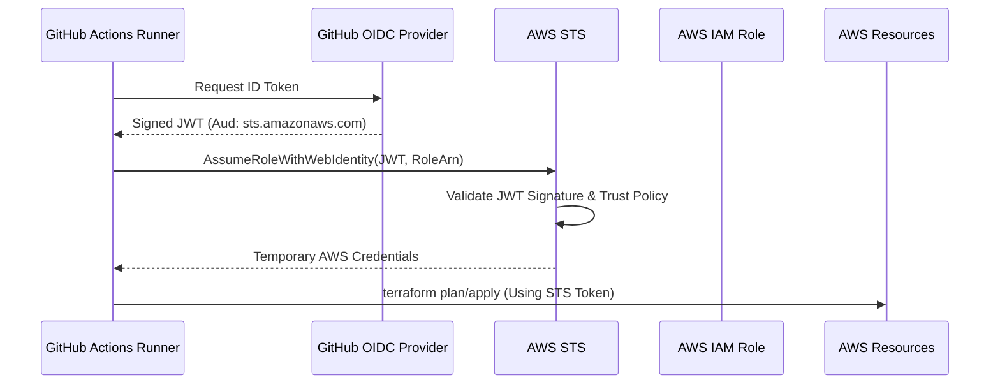

# 🛡️ AWS-GitHub OIDC Infrastructure-as-Code (IaC) Lifecycle

An advanced implementation of **Passwordless AWS Authentication** using OpenID Connect (OIDC) and Terraform. This project demonstrates a production-grade CI/CD pattern that eliminates long-lived IAM User access keys in favor of short-lived, identity-based STS tokens.

---

## 🏗️ Architectural Overview

The core of this repository is the **Identity Trust Relationship** between GitHub’s OIDC Provider and AWS IAM. This architecture ensures that infrastructure changes are only performed by authorized GitHub Runners.

### 🔐 The OIDC Handshake
1.  **JWT Issuance**: GitHub Actions issues a signed JSON Web Token (JWT) containing metadata about the runner (repo, branch, environment).
2.  **STS Verification**: The `aws-actions/configure-aws-credentials` action sends this JWT to AWS Security Token Service (STS).
3.  **Condition Matching**: AWS validates the token signature and checks the IAM Role's **Trust Policy** (specifically the `sub` and `aud` claims).
4.  **Assumed Role**: If valid, STS returns a temporary session token (lasting 1 hour by default) to the GitHub Runner.

### 🧩 System Design


---

## ⚡ Technical Deep Dive: The "Drift Detection" Policy

Terraform's AWS Provider (v4.x+) performs **exhaustive drift detection** during the `refresh` phase of a plan. This requires a much broader set of `Describe` permissions than simple resource creation. 

The policy below is specifically tuned to support **EC2 T-Series instances**, **Launch Templates**, and **EBS-backed volumes**, resolving the recursive `403 Unauthorized` errors encountered during state synchronization.

### 📜 Refined IAM Policy (Advanced Least Privilege)
```json
{
  "Version": "2012-10-17",
  "Statement": [
    {
      "Sid": "TerraformStateAccess",
      "Effect": "Allow",
      "Action": ["s3:ListBucket", "s3:GetBucketLocation"],
      "Resource": "arn:aws:s3:::your-tf-state-bucket"
    },
    {
      "Sid": "TerraformStateOperations",
      "Effect": "Allow",
      "Action": ["s3:GetObject", "s3:PutObject", "s3:DeleteObject"],
      "Resource": "arn:aws:s3:::your-tf-state-bucket/*"
    },
    {
      "Sid": "EC2LifecycleAndDriftDetection",
      "Effect": "Allow",
      "Action": [
        "ec2:DescribeImages",
        "ec2:DescribeInstances",
        "ec2:DescribeInstanceTypes",
        "ec2:DescribeTags",
        "ec2:DescribeSubnets",
        "ec2:DescribeSecurityGroups",
        "ec2:DescribeVpcs",
        "ec2:DescribeInstanceAttribute",
        "ec2:DescribeNetworkInterfaces",
        "ec2:DescribeInstanceStatus",
        "ec2:DescribeInstanceCreditSpecifications",
        "ec2:DescribeVolumes",
        "ec2:DescribeKeyPairs",
        "ec2:DescribeAvailabilityZones",
        "ec2:RunInstances",
        "ec2:TerminateInstances",
        "ec2:CreateTags"
      ],
      "Resource": "*"
    }
  ]
}
```

---

## 🛠️ Security Hardening: IAM Trust Relationship

To prevent "Cross-Repo Impersonation," your IAM Role's Trust Policy **must** restrict the `sub` (Subject) claim. This ensures only specific branches or environments in *your* repository can assume the role.

```json
{
  "Version": "2012-10-17",
  "Statement": [
    {
      "Effect": "Allow",
      "Principal": {
        "Federated": "arn:aws:iam::332779204286:oidc-provider/token.actions.githubusercontent.com"
      },
      "Action": "sts:AssumeRoleWithWebIdentity",
      "Condition": {
        "StringLike": {
          "token.actions.githubusercontent.com:sub": "repo:olayinka789/terraform-test-oidc:*"
        },
        "StringEquals": {
          "token.actions.githubusercontent.com:aud": "sts.amazonaws.com"
        }
      }
    }
  ]
}
```

---

## 🚀 CI/CD Pipeline Logic

The GitHub Actions workflow leverages the `id-token: write` permission, which is mandatory for OIDC token generation.

```yaml
name: "Terraform Infrastructure Deployment"

on:
  push:
    branches: [ main ]
  pull_request:

permissions:
  id-token: write # Required for OIDC
  contents: read  # Required for Checkout

jobs:
  deploy:
    runs-on: ubuntu-latest
    steps:
      - uses: actions/checkout@v4

      - name: Configure AWS Credentials
        uses: aws-actions/configure-aws-credentials@v4
        with:
          role-to-assume: ${{ secrets.AWS_ROLE_ARN }}
          aws-region: us-east-1

      - name: Terraform Init
        run: terraform init

      - name: Terraform Plan
        id: plan
        run: terraform plan -no-color -out=tfplan
```

---

## 💡 Lessons from the Field

*   **The 403 "Whack-a-Mole"**: We identified that Terraform calls `DescribeInstanceCreditSpecifications` even if you don't explicitly define credits in your HCL, as it needs to compare the remote state with the local schema.
*   **Provider Pinning**: When using OIDC, ensure you are using `aws-actions/configure-aws-credentials@v4` to support the latest Node.js runtimes and enhanced JWT handling.
*   **State Locking**: Always use a DynamoDB table for state locking in production to prevent concurrent execution conflicts.
